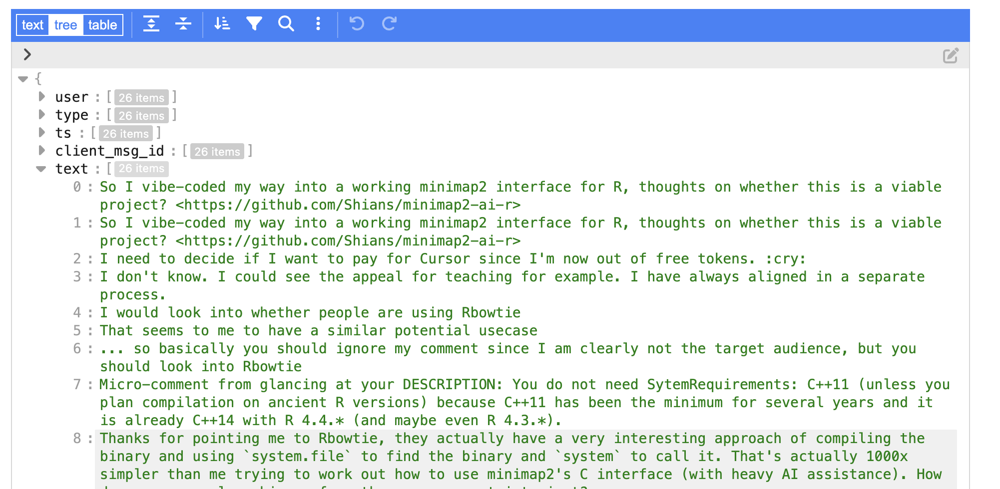
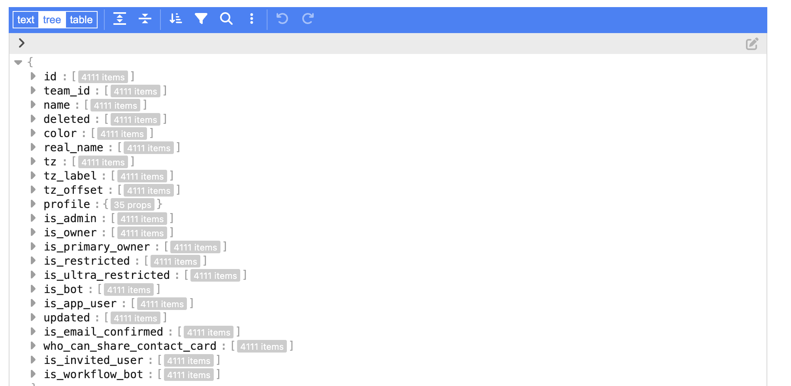

# slackExportDemo: Illustrate a slack export for 31-Mar-2025 - 3 April 2025

A workspace administrator can select dates for export and receive an email linking
to a zip file on the administrative page on exports.

Unzipping produces a tree of folders with json documents within:
```
.
├── accessible-vis
│   └── canvas_in_the_conversation.json
├── alpha-missense
│   └── canvas_in_the_conversation.json
├── bioc_africa
│   └── 2025-03-31.json
├── bioc-builds
│   ├── 2025-03-31.json
│   └── canvas_in_the_conversation.json
├── bioc-conference-everyone
│   ├── 2025-04-01.json
│   ├── 2025-04-03.json
│   └── canvas_in_the_conversation.json
├── biocwebsite
│   └── canvas_in_the_conversation.json
...
```

The json has a text element that can be viewed with listviewer::jsonedit:



The export includes a users.json with 4111 identities


